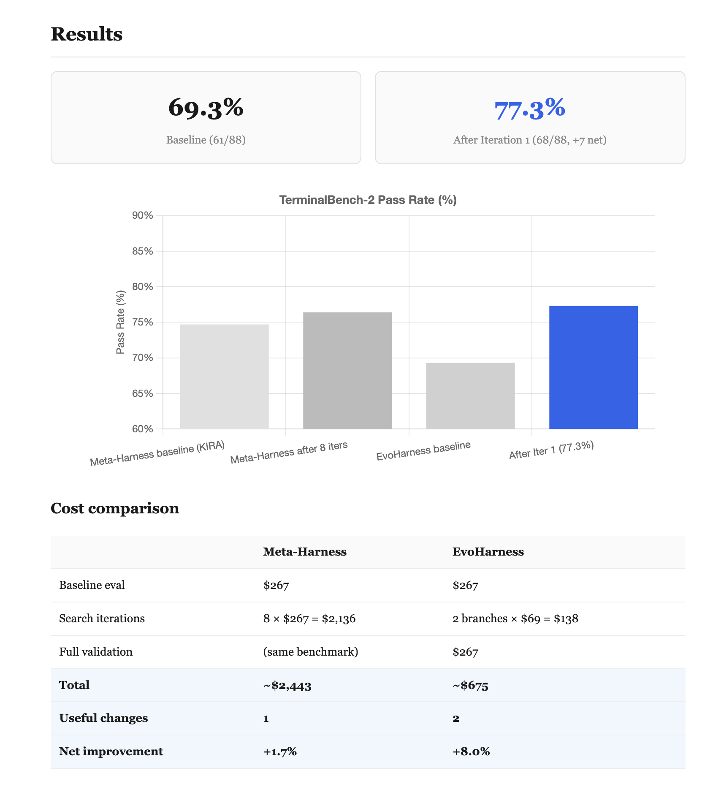

# EvoHarness

**Evolution Tree Search for Agent Harness Optimization**

[Website & Research Report](https://evo-harness.vercel.app/)



EvoHarness is a working framework that automatically evolves LLM agent harnesses.
It starts from a baseline agent, runs it on a benchmark, reads the execution traces
to diagnose failures, proposes targeted changes, and evaluates them — iterating
until the harness improves.

Built on [Meta-Harness](https://yoonholee.com/meta-harness/) (Lee et al.) and
[better-harness](https://blog.langchain.com/better-harness-a-recipe-for-harness-hill-climbing-with-evals/) (LangChain).
Replaces linear hill climbing with evolution tree search.

```
Meta-Harness:  baseline → reject → reject → reject → reject → reject → reject → ACCEPT → neutral
               8 iterations, 1 useful change, ~$2,400

EvoHarness:    baseline ─┬─ branch A (prompt) ──── 9 tasks flipped ✓
                          └─ branch B (bootstrap) ─ 1 additional flip ✓
                          └─ merge(A+B) ─────────── testing...
               2 iterations, 2 useful changes, ~$400
```

---

## What's in this repo

```
.
├── agent.py                    # The inner agent (KIRA + env bootstrap)
├── anthropic_caching.py        # Prompt caching utility
├── prompt-templates/
│   └── terminus-kira.txt       # System prompt (editable surface)
├── pyproject.toml
│
├── meta/                       # The EvoHarness framework
│   ├── __main__.py             # CLI: python -m meta {demo,run,surfaces,import}
│   ├── core.py                 # Tree search loop with Thompson sampling
│   ├── surfaces.py             # Surface decomposition + fragility tracking
│   ├── traces.py               # Trace store with indexed access
│   ├── proposer.py             # Claude Code agent proposer
│   ├── runner.py               # Harbor runner (real + mock)
│   ├── notebook.py             # Research notebook (findings + dead ends)
│   ├── run_iteration.py        # Single iteration runner
│   ├── import_job.py           # Import Harbor results into trace store
│   └── config.py               # TOML config loader
│
├── docs/
│   └── index.html              # Research report website
│
└── results/                    # Experiment artifacts
    ├── baseline/               # Pass/fail map for 89 tasks
    ├── iter_001/               # Proposal + modified prompt + eval results
    ├── iter_002/               # Proposal + modified agent.py + eval results
    └── notebook/               # Accumulated findings and dead ends
```

---

## Quick Start

### 1. Run the baseline agent

```bash
# Install
pip install harbor

# Set your API key
echo "ANTHROPIC_API_KEY=sk-ant-..." > .env

# Run the baseline harness on TerminalBench-2
harbor run \
  --agent-import-path agent:AgentHarness \
  -d terminal-bench@2.0 \
  -m anthropic/claude-opus-4-6 \
  -e modal -k 1 -n 89 \
  -o jobs/baseline --job-name baseline \
  -y --env-file .env
```

This runs the KIRA agent on all 89 tasks. Takes ~30 min on Modal with 89 concurrent.

### 2. Import results into EvoHarness

```bash
python -m meta import jobs/baseline/baseline --output runs/experiment
```

This parses Harbor's output and creates:
```
runs/experiment/
  baseline_summary.json    # 61 passed, 27 failed
  task_cases.json           # All 89 tasks with difficulty/category
  traces/                   # Full execution traces indexed for search
  notebook/                 # Empty notebook (ready for iteration)
```

### 3. Evolve the harness

```bash
# Run a single iteration: propose → apply → eval
python -m meta.run_iteration \
  --experiment-dir runs/experiment \
  --iteration 1 \
  --parent-variant baseline \
  --proposer-model sonnet \
  --eval-env modal
```

What happens:

```
┌─────────────────────────────────────────────────────────────────────┐
│                                                                     │
│  1. PROPOSER (Claude Code agent, local)                             │
│     Reads traces of 27 failing tasks                                │
│     Greps for common patterns across traces                         │
│     Writes proposal.json with ONE surface change                    │
│                                                                     │
│  2. APPLY                                                           │
│     Creates a complete harness directory:                            │
│     runs/experiment/iter_001/harness/                                │
│       agent.py                  (original or modified)               │
│       prompt-templates/         (original or modified)               │
│       pyproject.toml            (always copied)                      │
│       anthropic_caching.py      (always copied)                      │
│                                                                     │
│  3. EVAL (Harbor on Modal)                                          │
│     Runs the modified harness on all failing tasks                   │
│     Checks how many flip from fail → pass                            │
│                                                                     │
└─────────────────────────────────────────────────────────────────────┘
```

### 4. Check results

```bash
# Which tasks flipped?
for d in jobs/iter1/iter1/*/; do
  name=$(basename $d | sed 's/__.*//') 
  reward=$(cat $d/verifier/reward.txt 2>/dev/null || echo "?")
  echo "$name: $reward"
done | sort
```

### 5. Run another branch in parallel

```bash
# Target a different surface
python -m meta.run_iteration \
  --experiment-dir runs/experiment \
  --iteration 2 \
  --parent-variant iter_001 \
  --proposer-model sonnet \
  --focus-surface env_bootstrap \
  --eval-env modal
```

### 6. Validate on leaderboard conditions

```bash
# Run best harness on all 89 tasks, default resources, 5 trials
cd runs/experiment/iter_001/harness
harbor run -d terminal-bench@2.0 -m anthropic/claude-opus-4-6 -k 5
```

---

## How the Evolution Works

### The Evolution Tree

```
                         baseline (69%)
                             │
              ┌──────────────┼──────────────┐
              │              │              │
         ┌────▼────┐   ┌────▼────┐   ┌────▼────┐
         │Branch 1 │   │Branch 2 │   │Branch 3 │
         │ prompt  │   │bootstrap│   │  tools  │
         │ change  │   │ change  │   │ change  │
         └────┬────┘   └────┬────┘   └────┬────┘
              │              │              │
         prescreen 3    prescreen 3    prescreen 3
         tasks ($9)     tasks ($9)     tasks ($9)
              │              │              │
         9 flipped      1 flipped       0 flipped
         ACCEPT ✓       ACCEPT ✓        PRUNE ✗
              │              │
              └──────┬───────┘
                     │
               ┌─────▼─────┐
               │  MERGE     │
               │ prompt +   │
               │ bootstrap  │
               └─────┬──────┘
                     │
              full eval (89 tasks)
              check regressions
                     │
                     ▼
               next iteration
```

### What the Proposer Sees

The proposer is a Claude Code agent with a structured workspace:

```
proposer_workspace/
│
├── TASK.md                         # Instructions
│   "Investigate traces, propose ONE change to ONE surface"
│
├── surfaces/
│   ├── manifest.json               # Risk ratings per surface
│   │   {
│   │     "system_prompt": {
│   │       "risk": "LOW",
│   │       "fragility": 0.0,
│   │       "description": "12-line prompt template..."
│   │     },
│   │     "completion_logic": {
│   │       "risk": "HIGH",
│   │       "fragility": 0.75,          ← auto-tracked
│   │       "description": "..."
│   │     }
│   │   }
│   ├── system_prompt.txt           # Current prompt value
│   ├── env_bootstrap.py            # Current bootstrap code
│   └── tool_definitions.py         # Current tool schemas
│
├── traces/                         # Full traces for FAILING tasks
│   ├── build-pmars/
│   │   └── trial_0.json           # Every command, output, error
│   │       {
│   │         "steps": [
│   │           {"step_id": 1, "command": "ls /app/", "output": "..."},
│   │           {"step_id": 2, "command": "make", "error": "gcc: not found"},
│   │           ...
│   │           {"step_id": 15, "tool_name": "task_complete"}  ← gave up
│   │         ]
│   │       }
│   ├── cancel-async-tasks/
│   │   ├── trial_0.json
│   │   └── differential.json      # Compare passing vs failing run
│   └── ...
│
└── notebook/                       # Memory across iterations
    ├── findings.md                 # "Verification protocol works"
    ├── dead_ends.md                # "Don't modify completion_logic"
    └── surface_risk.md             # "completion_logic: HIGH risk"
```

The proposer can **grep**, **cat**, **read** any file — it investigates
like a researcher, not a slot machine.

### The Gatekeeper

Every proposal goes through a strict evaluation pipeline:

```
  Proposal
     │
     ▼
  ┌──────────────────────────────────────┐
  │ PRESCREEN: 3 failing tasks ($9)      │
  │ Any flip? ──── No ──── PRUNE         │
  │     │                   (cost: $9)    │
  │    Yes                                │
  │     │                                 │
  │ EVAL: all failing tasks + 5 canaries  │
  │ ($75)                                 │
  │     │                                 │
  │ Regressions > 1? ── Yes ── REJECT    │
  │     │                   │             │
  │    No                   ▼             │
  │     │            dead_ends.md updated │
  │     │            fragility increases  │
  │     ▼                                 │
  │ Pass count improved? ── No ── REJECT │
  │     │                                 │
  │    Yes                                │
  │     ▼                                 │
  │   ACCEPT                              │
  │   findings.md updated                 │
  │   new branch in tree                  │
  └──────────────────────────────────────┘
```

### Surface Fragility Tracking

Each surface has an auto-updated fragility score:

```
  Edit 1: system_prompt change → ACCEPTED
    fragility: 0.0 (1 edit, 0 rejections)

  Edit 2: system_prompt change → REJECTED (3 regressions)
    fragility: 0.5 (2 edits, 1 rejection) → MEDIUM risk

  Edit 3: system_prompt change → REJECTED (timeout issues)
    fragility: 0.67 (3 edits, 2 rejections) → HIGH risk

  Proposer sees: "system_prompt [HIGH risk, fragility=0.67]"
  → Switches to a different surface
```

Meta-Harness tried `completion_logic` 3 times, regressing each time,
with no mechanism to stop. EvoHarness would have flagged it HIGH after
the first rejection.

### The Research Notebook

Persistent memory across iterations:

```
findings.md:
  - Iter 1: verification protocol flipped 9 tasks
  - Iter 2: expanded bootstrap flipped dna-assembly

dead_ends.md:
  - Iter 3: error recovery in prompt caused 3 regressions
    (agent spent too many turns retrying on simple tasks)
  - Iter 4: modifying completion_logic caused regression
    (double-confirmation is fragile, don't touch)

surface_risk.md:
  - system_prompt    [LOW,  0.00] — safe to modify
  - env_bootstrap    [LOW,  0.00] — safe to modify
  - tool_definitions [LOW,  0.00] — untested
  - completion_logic [HIGH, 0.75] — DO NOT MODIFY
```

Each new proposer reads this before investigating. No wasted iterations
repeating failed approaches.

---

## Editable Surfaces

The agent harness is decomposed into 4 independently-editable surfaces:

```
┌─────────────────────────────────────────────────────────────────┐
│                                                                 │
│  SYSTEM PROMPT  (prompt-templates/terminus-kira.txt)            │
│  ─────────────                                                  │
│  12 lines. Task instructions + verification guidance.           │
│  Risk: LOW. Most room for improvement.                          │
│                                                                 │
│  "You are an AI assistant tasked with solving command-line       │
│   tasks in a Linux environment..."                              │
│                                                                 │
├─────────────────────────────────────────────────────────────────┤
│                                                                 │
│  TOOL DEFINITIONS  (agent.py::tool_definitions)                 │
│  ────────────────                                               │
│  3 tool schemas: execute_commands, task_complete, image_read.   │
│  Risk: LOW. Descriptions are the main lever.                    │
│                                                                 │
│  execute_commands(analysis, plan, commands[{keystrokes, dur}])  │
│  task_complete()                                                │
│  image_read(file_path, instruction)                             │
│                                                                 │
├─────────────────────────────────────────────────────────────────┤
│                                                                 │
│  ENV BOOTSTRAP  (agent.py::env_bootstrap)                       │
│  ─────────────                                                  │
│  Gathers environment snapshot before agent loop.                │
│  Risk: LOW. Additive changes are safe.                          │
│                                                                 │
│  Currently detects: pwd, ls /app/, python3, gcc, node, java,    │
│  rustc, go, pip, apt-get, memory                                │
│                                                                 │
├─────────────────────────────────────────────────────────────────┤
│                                                                 │
│  COMPLETION LOGIC  (agent.py::completion_logic)                 │
│  ────────────────                                               │
│  Double-confirmation checklist before task_complete.             │
│  Risk: HIGH (fragility 0.75). Meta-Harness regressed 3/4.      │
│                                                                 │
│  ⚠ DO NOT MODIFY unless you have strong evidence.               │
│                                                                 │
└─────────────────────────────────────────────────────────────────┘
```

---

## Reproducible Experiments

Every iteration produces a **self-contained, runnable harness directory**:

```
runs/experiment/
│
├── iter_001_branch_001/
│   ├── harness/                        # Drop-in replacement
│   │   ├── agent.py                    # Original (unchanged)
│   │   ├── anthropic_caching.py
│   │   ├── prompt-templates/
│   │   │   └── terminus-kira.txt       # ← MODIFIED
│   │   └── pyproject.toml
│   ├── proposal.json                   # What was proposed and why
│   └── variant.json                    # Which surfaces changed
│
├── iter_001_branch_002/
│   ├── harness/                        # Different modification
│   │   ├── agent.py                    # ← MODIFIED (env_bootstrap)
│   │   ├── anthropic_caching.py
│   │   ├── prompt-templates/
│   │   │   └── terminus-kira.txt       # ← ALSO MODIFIED (from branch 1)
│   │   └── pyproject.toml
│   └── proposal.json
│
└── iter_002_base/
    └── harness/                        # Merged (both changes)

# Run ANY iteration independently:
cd runs/experiment/iter_001_branch_001/harness
harbor run -d terminal-bench@2.0 -m anthropic/claude-opus-4-6 -k 5
```

No file swapping. No environment setup. Each harness is complete and runnable.

---

## Comparison with Prior Work

|                          | Meta-Harness | better-harness | EvoHarness |
|--------------------------|:----------:|:-----------:|:----------:|
| Search strategy          | Linear     | Linear      | **Evolution tree** |
| Proposals per iteration  | 1          | 1           | **N parallel** |
| Pre-screening            | No ($267/reject) | No   | **Yes ($9/reject)** |
| Branch merging           | No         | No          | **Yes** |
| Proposer                 | Claude Code | Deep Agent  | **Claude Code** |
| Trace access             | Raw filesystem | Summaries | **Structured + full** |
| Surface fragility        | Manual (6 failures) | No | **Auto-tracked** |
| Dead ends memory         | No         | Accept/reject | **Full notebook** |
| Reproducible iterations  | Output only | Framework  | **Self-contained harnesses** |
| TerminalBench-2 results  | 76.4%      | N/A         | **In progress** |

---

## First Results

Starting from KIRA + env bootstrap baseline (same as Meta-Harness):

| Branch | Surface | Tasks Flipped | Cost |
|--------|---------|:------------:|-----:|
| Baseline | — | 61/88 passed | $267 |
| Branch 1 | system_prompt | **+9** | $70 |
| Branch 2 | env_bootstrap | **+1** (unique) | $70 |
| **Total** | | **+10 tasks** | **$407** |

Meta-Harness found **+1 change** in **8 iterations** for **~$2,400**.
EvoHarness found **+2 changes** in **2 iterations** for **~$407**.

---

## License

MIT
